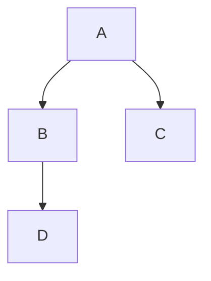
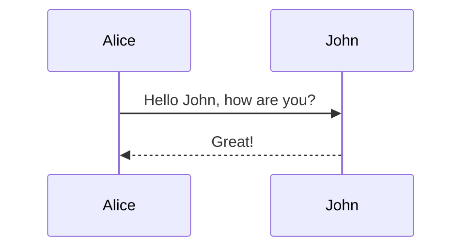
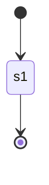
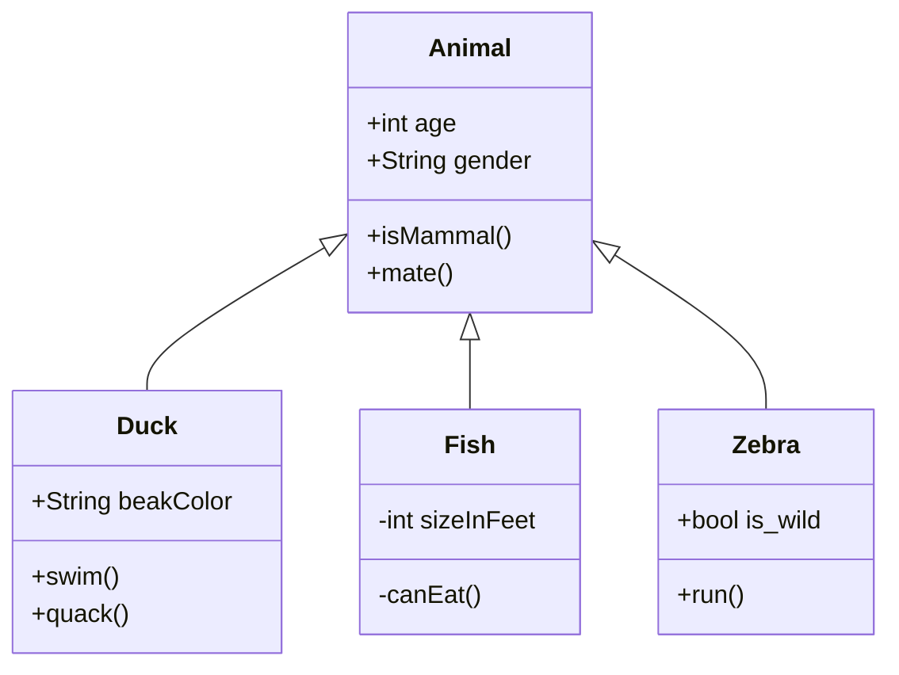
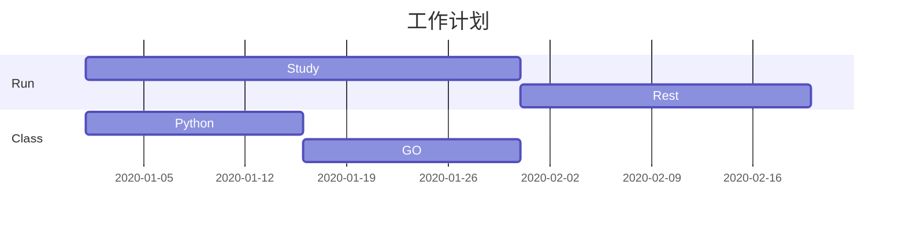
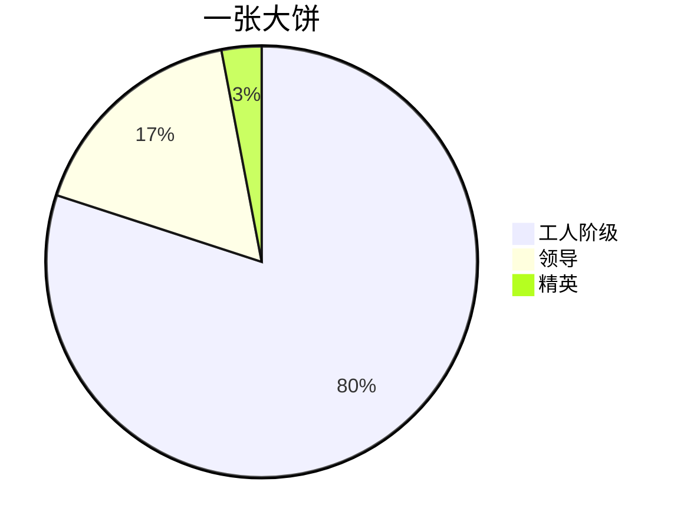

<!--
title: Typora
sort:
-->

# Typora 笔记

官方网站：[typora](https://www.typora.io/)

### 自动上传图片

> picgo 与 gitee

## 基本使用

> 链接： [test](www.baidu.com)
>
> 删除线：~~test~~
>
> 上标： x^4^
>
> 下标： H~2~
>
> 数学： $e^2$
>
> - [x] asdf
>
> test[^1]
>
> [^1]: it's a infomation
>
> :happy:
>
> [锚链接](#test)
>
> <https://www.baidu.com>

### 源代码

```markdown
链接: [test](www.baidu.com)
删除线: ~~test~~
上标: X^4^
下标: H~2~
数学 $e^2$
方框: - [ ] asdf - [x] asdf
说明: test[^1]
[^1]:it's a infomation
Emoji: :happy:
锚链接: [锚链接](#test) ## 流程图 {#test}
快速链接： <https://www.baidu.com>
```

## 插入图片

- 插入本地图片：(不灵活，不便于分享)

  ```markdown
   # Linux
   # windows
  ```

- 插入网络图片：

  ```markdown
  
  ```

- 把图片插入 markdown 文件：

  ```markdown
  
  ```

  > 但是会影响写文章的体验。
  >
  > 可以把大段的 base64 字符串放在文章末尾，然后在文章中通过一个 id 来调用。

  ```markdown
  ![avatar][test]
  [test](data:image/png;base64,iVBORw0KGgoAAAANSUh...)
  ```

## 绘图

### 流程图

```
# mermaid
graph TD;
    A-->B;
    A-->C;
    B-->D;
```

> TD 代表方向：Top-Down



### 时序图

```
sequenceDiagram
    Alice->>John: Hello John, how are you?
    John-->>Alice: Great!
```

> `->>` 代表实线箭头，`-->>` 则代表虚线。



### 状态图

```
stateDiagram
    [*] --> s1
    s1 --> [*]
```

> `[*]` 表示开始或者结束，如果在箭头右边则表示结束。



### 类图

```
classDiagram
      Animal <|-- Duck
      Animal <|-- Fish
      Animal <|-- Zebra
      Animal : +int age
      Animal : +String gender
      Animal: +isMammal()
      Animal: +mate()
      class Duck{
          +String beakColor
          +swim()
          +quack()
      }
      class Fish{
          -int sizeInFeet
          -canEat()
      }
      class Zebra{
          +bool is_wild
          +run()
      }
```

> `<|--` 表示继承，`+` 表示 `public`，`-` 表示 `private`。



### 甘特图

```
gantt
    title 工作计划
    dateFormat  YYYY-MM-DD
    section 		Run
    Study			:a1, 2020-01-01, 30d
    Rest			:after a1, 20d
    section			Class
    Python      	:2020-01-01, 15d
    GO				:15d
```



### 饼图

```
pie
    title 一张大饼
    "工人阶级" : 80
    "领导" : 17
    "精英" : 3
```


